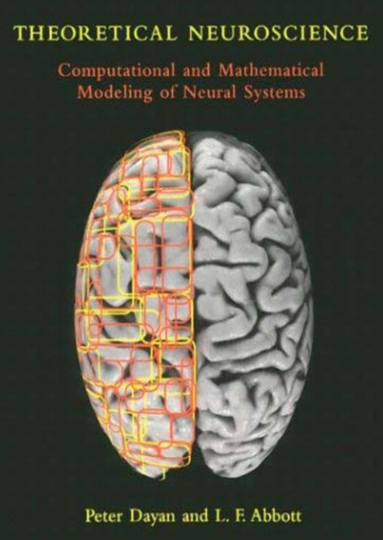

# Cognitive-Computational-Neuroscience-online-Reading-Club
**第一期书籍**：[Theoretical Neuroscience-Peter Dayan and L.F. Abbott](https://ltudsct96t.feishu.cn/file/boxcnlMJL1ZxaFJ0bJccqJTUrud)

**CCNoRC目的**：

阅读认知计算神经科学(Cognitive Computational Neuroscience) / 计算精神病 (Computational Psychiatry) 相关的经典书目和章节，建立学科框架，扎实基础知识。

**CCNoRC形式**：

1. 根据章节内容安排时间表，建立学习小组(WeChat)，平时在小组内部讨论，读书会第1期由日本山口大学雷慧洁同学带领（香港大学博士后[Haiyang Geng 耿海洋(HKU)](https://www.psychology.hku.hk/scnlab/people.html)等人提供建议）
2. 半个月一次线上分享讨论，时间1-2小时，由小组内部成员轮流作为分享人(每次2人分享，其他成员参与讨论，视情况考虑是否公开旁听)，分享章节和报告人排入日程表，提前预告，方便大家讨论。
3. 周四晚8点到10点（北京时间），采用腾讯会议的形式。
4. 读书会第1期预计招募8-10人

**读书会详细介绍**：[见Sophon Academy公众号文章](https://mp.weixin.qq.com/s/KWYJDZ00eyUXMniMQ0O14Q)

**读书会每期将整理成详实的文章发表在Sophon Academy公众号**，**关注公众号追踪读书会最新动态**：

**请加小助手微信进入计算精神病交流群**：

## 日程安排

| 小组 |             小节             |  时间   | 组员                                               | 相关材料                                                     |
| :--: | :--------------------------: | :-----: | -------------------------------------------------- | ------------------------------------------------------------ |
|  1   |  9.2 Classical Conditioning  | 6月17日 | 吕同学 李同学 雷同学 陈同学 张同学 | [PPT1](https://ltudsct96t.feishu.cn/file/boxcnclS9zu3EIU4GMcXQCLTcgd),[PPT2](https://ltudsct96t.feishu.cn/file/boxcnwoeIdkF14LGHqlUtCxDPj6) |
|  2   |   9.3 Static Action Choice   | 7月1日  | 王同学 郭同学 黄同学 沈同学 蒋同学 | [PPT](https://ltudsct96t.feishu.cn/file/boxcnZyM3rdKoglEATgoD8d6xOQ),[视频](https://ltudsct96t.feishu.cn/file/boxcnzCy6tI12HQj8YyZQ9zOiFg) |
|  3   | 9.4 Sequential Action Choice | 7月15日 | 蔡同学 耿同学 王同学 于同学 杨同学 | [PPT](https://ltudsct96t.feishu.cn/file/boxcn7iINGcxliqfA2FzBAglNKe ),[视频](https://ltudsct96t.feishu.cn/file/boxcnuyHLs0tdqAwDw7zIjM13me) |
|  4   |           Appendix           | 7月29日 | 周同学 金同学 谭同学 杨同学 李同学 | [PPT](https://ltudsct96t.feishu.cn/file/boxcn2R3u3HlhHKkJhyTuVgMvbE),[视频](https://ltudsct96t.feishu.cn/file/boxcn2eEOEzSpjLU8uUCXPvPwRe) |

